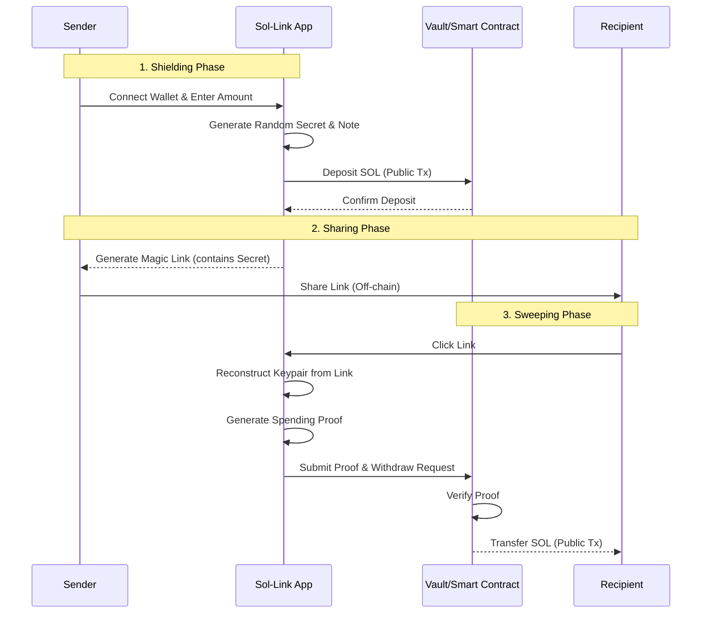

# 🛡️ Sol-Link: Private SOL Sharing via ZK Mixer Links


**Sol-Link** is a privacy-first application that enables users to send **SOL** anonymously via secure, shareable links. Powered by **Privacy Cash**'s zero-knowledge proofs and **Helius** RPCs, Sol-Link ensures that the sender and receiver addresses remain unlinkable on-chain.

> 🚀 **Built for the Solana Privacy Hackathon 2026**

---

## 🏗️ The Problem

On public blockchains like Solana, every transaction is visible.
- **Sender & Receiver are public**: Anyone can trace a payment back to you.
- **Transaction History is open**: Your financial fingerprint is exposed.
- **No private gifting**: You can't send money to a friend without them knowing your wallet address.

**Sol-Link solves this** by breaking the on-chain link between the depositor and the recipient using cryptographic "Notes" and Zero-Knowledge principles.

---

## 🌊 How It Works (The Process)

### 1️⃣ **Shield (Deposit)**
The sender connects their wallet and deposits SOL into the Sol-Link protocol.
- The app generates a random **Secret Key** locally.
- A **Note** (UTXO) is created representing the deposit amount.
- The SOL is sent to a shared **Vault Program**.

### 2️⃣ **Link Generation**
- The app embeds the **Secret Key** into a unique, shareable URL.
- **Crucial**: This key is **never** sent to the server. It lives only in the link and the user's clipboard.

### 3️⃣ **Share**
- The sender shares the link with the recipient via any secure channel (Signal, WhatsApp, Telegram, Email).

### 4️⃣ **Sweep (Claim)**
- The recipient opens the link.
- The app extracts the **Secret Key** from the URL fragments.
- It derives the proofs needed to authorize the withdrawal.
- The funds are "swept" from the Vault directly to the recipient's wallet (or a fresh wallet for max privacy).

---

## 🔄 Flow Diagram



---

## 🔐 Privacy Cash SDK Integration

Sol-Link relies heavily on the core cryptographic primitives provided by the **Privacy Cash SDK**. We have integrated key components directly into our application logic to ensure robust privacy.

### Core Components Used:

*   **🔑 `keypair.ts` (Shielded Keys)**:
    *   We use the SDK's keypair generation to create ephemeral **shielded addresses** specifically for each deposit note.
    *   This ensures that the keys controlling the funds are distinct from the user's main wallet.

*   **🧾 `utxo.ts` (Note Management)**:
    *   Implements the **UTXO (Unspent Transaction Output)** model from Privacy Cash.
    *   Every deposit is treated as a discrete "Note" object containing the amount, blinding factor, and owner credentials.

*   **🌳 `merkle_tree.ts` (Commitments)**:
    *   Uses Merkle Trees to store **commitments** of deposited notes.
    *   This allows us to prove membership (that a deposit exists) without revealing *which* deposit is being spent.

*   **🕵️ `prover.ts` (ZK Proofs)**:
    *   Leverages `snarkjs` and `circomlib` to generate **Zero-Knowledge Proofs** client-side.
    *   These proofs verify that the user possesses the valid secret key for a note in the Merkle tree **without revealing the key itself**.

---

## ⚡ Technology Stack

*   **Frontend**: Next.js 14, React 19, TailwindCSS, Framer Motion
*   **Blockchain Interaction**: `@solana/web3.js`, `@solana/wallet-adapter`
*   **Privacy & Cryptography**: `circomlib`, `snarkjs`, `ffjavascript`
*   **Infrastructure**: **Helius RPC** for high-speed transaction confirmations and state queries.
*   **Styling**: Custom design system using Syne & Bricolage Grotesque fonts.

---

## 🏃‍♂️ Setup & Run Locally

1.  **Clone the repository**
    ```bash
    git clone https://github.com/NikhilRaikwar/SolLink.git
    cd sol-link
    ```

2.  **Install Dependencies**
    ```bash
    pnpm install
    # or
    npm install
    ```

3.  **Configure Environment**
    Create a `.env.local` file and add your Helius RPC URL:
    ```env
    NEXT_PUBLIC_HELIUS_RPC_URL=https://devnet.helius-rpc.com/?api-key=YOUR_KEY
    ```

4.  **Run Development Server**
    ```bash
    pnpm dev
    ```

5.  **Open in Browser**
    Visit `http://localhost:3000` to start shielding SOL!

---

## 🏆 Hackathon Tracks & Bounties

We are targeting the following tracks in the **Solana Privacy Hack 2026**:

### 🎯 Primary Tracks
*   **Track 01: Private Payments**: Enabling private, unlinkable value transfer.
*   **Track 02: Privacy Tooling**: Providing a reusable, link-based privacy primitive.

### 💰 Sponsor Bounties
*   **Privacy Cash**: For "Best Integration" by porting and utilizing the core UTXO/Prover SDK logic (`src/lib/privacy-cash`).
*   **Helius**: For "Best Privacy Project" leveraging Helius RPCs for performant, lag-free user experiences during claim sweeps.

---

<p align="center">
  Built with ❤️ by the Sol-Link Team
</p>
